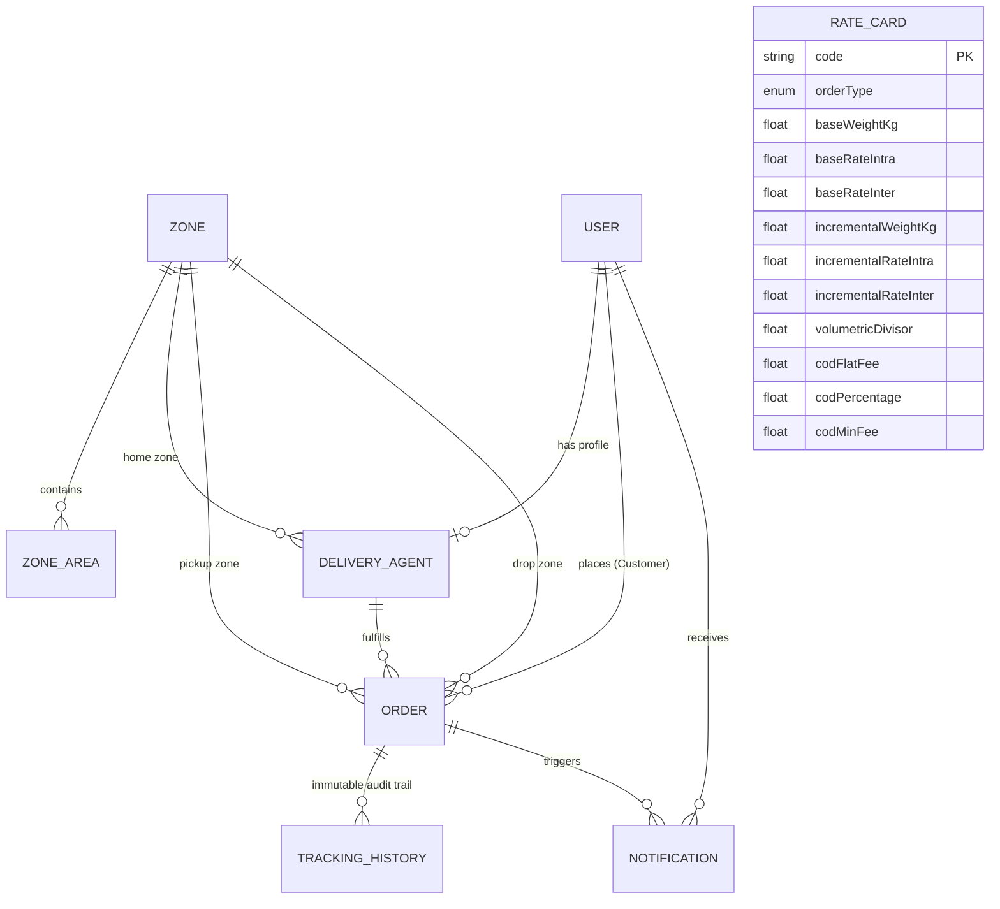

# 🚀 Last-Mile Delivery Tracker Platform

> **Enterprise-Grade Last-Mile Delivery Management, Dynamic Multi-Zone Tariff Engine, Intelligent Fleet Dispatch, and Immutable Tracking Ledger.**


---

## 🌟 Key System Capabilities

1. **Dynamic Multi-Zone Rate Calculation Engine**:
   - Computes Volumetric Weight: $(L \times B \times H) \div 5000$.
   - Determines Chargeable Weight: $\max(\text{Actual Weight}, \text{Volumetric Weight})$.
   - Spatial Zone Detection: Auto-detects pickup & drop zones, resolving `INTRA_ZONE` vs `INTER_ZONE`.
   - Real-time Rate Card Lookup for **B2C Retail** and **B2B Commercial Freight** (Base slabs, incremental weights).
   - Configurable COD Surcharges (Flat fee, percentage, minimum floor).
   - **Zero Hardcoding**: All tariff cards, slabs, divisors, and rates are 100% database-driven and editable live via Admin UI.

2. **Intelligent Agent Auto-Assignment Engine**:
   - Geolocation distance calculation using the **Great-Circle Haversine Formula**.
   - Multi-factor composite heuristic balancing distance proximity, active queue load, home-zone affinity, driver status, and ratings.
   - Atomic database assignment transactions ensuring no driver exceeds capacity.

3. **Three Dedicated Role-Based Portals**:
   - **Customer Portal**: Instant shipping quote calculator, one-click booking, live order tracking with animated Leaflet map & step-by-step progress timeline, and one-click rescheduling for failed deliveries.
   - **Delivery Partner Hub (Mobile-First)**: Driver availability toggle, GPS updater, task queue, step-by-step lifecycle actions, digital signature canvas proof-of-delivery, and failure reason capture.
   - **Admin Operations Control Center**: Real-time KPI dashboard, Order Master Hub with manual/auto-assignment & status override, Zone & Pincode coverage manager, Rate Card editor, Fleet Telemetry Map, and Immutable Audit Trail inspector.

4. **Resilient Failed Delivery & Customer Reschedule Lifecycle**:
   - When marked `FAILED`, the driver's queue is immediately freed up.
   - Automated multi-channel notifications (Email/SMS) are dispatched with a secure one-click reschedule link.
   - Customer selects new date & preferred time slot (Morning/Afternoon/Evening).
   - Order transitions to `RESCHEDULED` and is automatically reassigned to the best available partner.

5. **Immutable Append-Only Audit History**:
   - Every status transition is logged with timestamp, actor (`CUSTOMER`/`AGENT`/`ADMIN`/`SYSTEM`), geolocation, remarks, and digital proof data.

---

## ⚡ Quick Start Guide

### Prerequisites
- **Node.js**: v18+ (tested on Node v22.19.0)
- **npm**: v9+ (tested on npm 11.5.2)

### 1. Install All Dependencies
```bash
npm run install:all
```
*(Installs root orchestrator, `server/`, and `client/` packages in one command)*

### 2. Initialize Database & Seed Realistic Logistics Network
```bash
npm run seed
```
*(Populates Metro Logistics Zones, B2B & B2C Rate Cards, Demo Customers, Agents with GPS coordinates, and Sample Orders across all lifecycle states)*

### 3. Launch Development Server (Concurrently runs Backend & Frontend)
```bash
npm run dev
```
- 🌐 **Frontend Application**: `http://localhost:5173`
- 🚀 **Backend API**: `http://localhost:5000`
- 📚 **API Health Check**: `http://localhost:5000/api/health`

---

## 🔑 Demo Access Credentials

The application features an **Instant Demo Role Switcher** in the navigation bar to switch between roles with a single click. You can also sign in manually:

| Role | Email | Password | Description |
| :--- | :--- | :--- | :--- |
| 👑 **Administrator** | `admin@delivery.com` | `admin123` | Fleet Director with full tariff, zone, and override controls |
| 👤 **Customer (B2C)** | `john@example.com` | `password123` | Individual retail customer placing prepaid & COD orders |
| 🏢 **Corporate Client (B2B)** | `sarah.b2b@apexlogistics.com` | `password123` | Apex Electronics Global Pvt Ltd (Commercial heavy freight) |
| 🛵 **Delivery Agent 1** | `rajesh.agent@delivery.com` | `password123` | Active rider in Mumbai Suburbs (MH-01-BK-1080) |
| 🛵 **Delivery Agent 2** | `amit.agent@delivery.com` | `password123` | Active rider in Mumbai Central (MH-02-EV-7722) |

---

## 📐 Rate Calculation Engine Logic

```
   [ Package Dimensions (L, W, H) in cm ]
                     │
                     ▼
  Volumetric Weight = (L × W × H) ÷ 5000
                     │
   [ Actual Package Weight in kg ]
                     │
                     ▼
  Chargeable Weight = max(Actual Weight, Volumetric Weight)
                     │
                     ▼
  Zone Lookup (Pickup Pincode ➔ Zone A, Drop Pincode ➔ Zone B)
  If Zone A == Zone B ➔ INTRA_ZONE, Else ➔ INTER_ZONE
                     │
                     ▼
  Rate Card Lookup for OrderType (B2C or B2B)
  Excess Weight = max(0, Chargeable Weight - Base Weight)
  Incremental Slabs = ⌈Excess Weight ÷ Incremental Slab Wt⌉
  Subtotal = Base Rate + (Incremental Slabs × Incremental Rate)
                     │
                     ▼
  COD Surcharge (if Payment is COD):
  COD Fee = max(CodMinFee, CodFlatFee + (Subtotal × CodPercentage ÷ 100))
                     │
                     ▼
  Total Delivery Charge = Subtotal + COD Surcharge
```

### Pre-Configured Rate Cards

#### 1. Standard B2C Rate Card (`RATE-B2C-STD`)
- **Base Weight**: 0.5 kg
- **Base Rate (Intra-Zone)**: ₹45.00 | **Base Rate (Inter-Zone)**: ₹75.00
- **Incremental Weight Slab**: 0.5 kg
- **Incremental Rate (Intra-Zone)**: ₹25.00 | **Incremental Rate (Inter-Zone)**: ₹45.00
- **Volumetric Divisor**: 5000 cm³/kg
- **COD Surcharge**: ₹15.00 flat + 1.5% of subtotal (Minimum ₹30.00 floor)

#### 2. B2B Commercial Freight Card (`RATE-B2B-EXP`)
- **Base Weight**: 2.0 kg
- **Base Rate (Intra-Zone)**: ₹120.00 | **Base Rate (Inter-Zone)**: ₹210.00
- **Incremental Weight Slab**: 1.0 kg
- **Incremental Rate (Intra-Zone)**: ₹30.00 | **Incremental Rate (Inter-Zone)**: ₹55.00
- **Volumetric Divisor**: 5000 cm³/kg
- **COD Surcharge**: ₹25.00 flat + 2.0% of subtotal (Minimum ₹50.00 floor)

---

## 🧭 Intelligent Auto-Assignment Heuristic

### Great-Circle Haversine Proximity
$$d = 2R \cdot \arcsin\left(\sqrt{\sin^2\left(\frac{\Delta \phi}{2}\right) + \cos(\phi_1)\cos(\phi_2)\sin^2\left(\frac{\Delta \lambda}{2}\right)}\right)$$
*(where $R = 6371\text{ km}$)*

### Composite Penalty Objective Function
$$\text{Penalty Score} = (1.2 \times d_{\text{km}}) + (3.5 \times \text{ActiveOrders}) + (5.0 \times \text{IsBusy}) - (8.0 \times \text{IsHomeZone}) - (2.0 \times (\text{Rating} - 3.0))$$

The agent candidate yielding the minimal composite score is atomically assigned within a database transaction.

---

## 🗄️ Database Schema & Data Models



---

## 📡 REST API Documentation

### Authentication (`/api/auth`)
- `POST /api/auth/register`: Create customer or agent account.
- `POST /api/auth/login`: Authenticate with email/password; returns JWT.
- `GET /api/auth/me`: Get current user profile.
- `GET /api/auth/demo-accounts`: List pre-configured demo test users.

### Rate Calculation (`/api/rates`)
- `POST /api/rates/calculate`: Calculate shipping estimate (inputs: pincodes, dimensions $L\times B\times H$, weight, orderType, paymentType).
- `GET /api/rates/cards`: List all active rate cards.
- `POST /api/rates/cards`: [Admin] Create rate card.
- `PUT /api/rates/cards/:id`: [Admin] Update rate card.

### Order Management (`/api/orders`)
- `POST /api/orders`: Place delivery order (calculates rate, detects zones, initializes tracking history, dispatches alerts).
- `GET /api/orders`: Query orders with multi-field filters (`status`, `zoneId`, `agentId`, `orderType`, `paymentType`, `search`).
- `GET /api/orders/:id`: Get order with complete relational graph.
- `GET /api/orders/track/:trackingNumber`: Public/customer tracking endpoint.
- `GET /api/orders/:id/candidates`: Evaluate ranked candidate agents for an order.
- `PATCH /api/orders/:id/status`: [Agent/Admin] Transition order status (`PICKED_UP`, `IN_TRANSIT`, `OUT_FOR_DELIVERY`, `DELIVERED`, `FAILED`).
- `POST /api/orders/:id/reschedule`: [Customer/Admin] Reschedule failed order for new date/time slot.
- `POST /api/orders/:id/auto-assign`: [Admin] Trigger intelligent auto-assignment.
- `POST /api/orders/:id/assign`: [Admin] Manually assign specific delivery partner.
- `PATCH /api/orders/:id/admin-override`: [Admin] Override state with mandatory audit reason.

### Zone Management (`/api/zones`)
- `GET /api/zones`: List all active delivery zones and mapped pincodes.
- `POST /api/zones`: [Admin] Create zone with GPS center and radius.
- `POST /api/zones/:zoneId/areas`: [Admin] Map new area/pincode to zone.

### Fleet & Telemetry (`/api/agents`)
- `GET /api/agents`: List all agents with live coordinates, status, and active load.
- `PATCH /api/agents/profile`: Update agent status (`AVAILABLE`, `OFFLINE`) or coordinates.

### Analytics & Notifications (`/api/analytics`, `/api/notifications`)
- `GET /api/analytics/dashboard`: [Admin] KPI metrics, revenue, and order breakdown.
- `GET /api/notifications/my`: User notifications feed.
- `GET /api/notifications/all`: [Admin] All dispatched carrier Email & SMS logs.
- `GET /api/notifications/audit-logs`: [Admin] Chronological append-only system event ledger.

---

## 🧪 Automated Testing Suite

Run the full automated test suite covering the Rate Engine, Auto-Assignment Haversine calculations, and Lifecycle State Machine:
```bash
npm run test
```
**Test Coverage Includes:**
- ✅ B2C Intra-Zone Actual Weight Dominant pricing.
- ✅ B2B Inter-Zone Volumetric Weight Dominant pricing & COD Minimum Fee Surcharges.
- ✅ Negative & zero dimension validations.
- ✅ Haversine distance calculations against known geographic coordinates.
- ✅ Agent capacity constraints & candidate penalty scoring.
- ✅ Order Lifecycle Transitions (`CONFIRMED` $\to$ `ASSIGNED` $\to$ `PICKED_UP` $\to$ `FAILED` $\to$ `RESCHEDULED`).
- ✅ Immutable audit tracking ledger verification.

---

## 📦 Packaging Deliverable ZIP

Generate the final clean deliverable ZIP package containing complete source code, schema, and documentation:
```bash
npm run package:zip
```
*(Saves compressed package to `deliverables/last-mile-delivery-tracker.zip`)*
